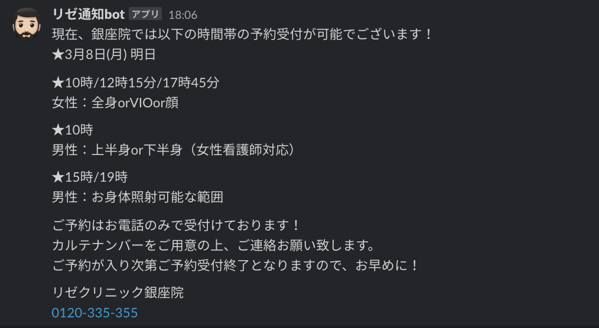

# rezeclinic-slack

## 設定が必要なスクリプトプロパティ

| name                   | 内容                                                  |
| ---------------------- | ----------------------------------------------------- |
| SLACK_INCOMING_WEBHOOK | 通知したい workspace で取得した incomming webhook URL |
| SLACK_CHANNEL_NAME     | post したいチャンネル名(`#`は必要ない)                |

## 追加する必要があるライブラリ

- Parser
  - スクリプト ID: 1Mc8BthYthXx6CoIz90-JiSzSafVnT6U3t0z_W3hLTAX5ek4w0G_EIrNw
